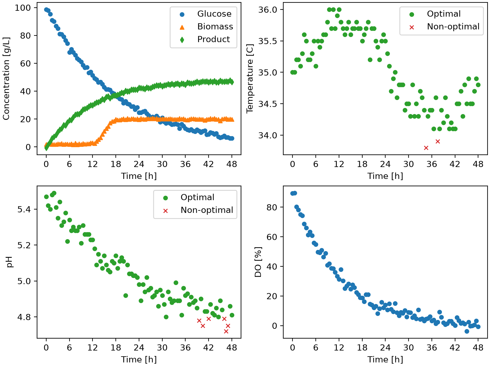

# How varying pH and Temperature affects the cell growth of a Fermentation process.

## Overview
This project aimed to automated the analysis of batch fermentation data using a custom python class. This program evaluates whether process measurements remain within pH and temperature ranges, generates visual dashboards for each batch and creates summary tables describing the processes performance

### Features
- Extracts individual fermentation batches.
- Checks pH and temperature operating ranges.
- Generates dashboard figures.
- Generates summary tables ith key batch results.
### Technologies Used
- Python 3.14.7
- pandas
- numpy
- Matplotlib
### Code Design
When 'main.py' is run the following operations are executed; 
1. The fermentation dataset is loaded
2. Each batch is analyzed using the `BioprocessMonitor` class
3. Both Dashboard figures and summary tables are generated and saved respectively under figures and tables.
### Dashboard

The dashboard provides a visual summary of one of the fermentation batch modes.
The four panels show:

1. Top left: Glucose, biomass, and product concentrations over time.
2. Top right: Temperature measurements over time, with acceptable measurements shown as green circles and measurements outside the acceptable range shown as red X markers.
3. Bottom left: pH measurements over time, using the same acceptable and non-acceptable classification.
4. Bottom right: Dissolved oxygen concentration over time.

### Summary Table
The following summary table describes the percentage of pH and temperature measurements within the acceptable operating ranges and the final product concentration for each batch.

|batch_id|ph_optimal_percent|temperature_optimal_percent|C_product_g_L^-1_final|
|--------|------------------|---------------------------|----------------------|
|1       |93.81             |97.94                      |46.5                  |
|2       |96.69             |97.52                      |50.8                  |
|3       |95.89             |93.15                      |44.6                  |
|4       |100.0             |96.47                      |48.6                  |
|5       |48.62             |99.08                      |24.7                  |
